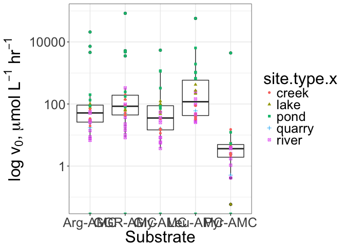
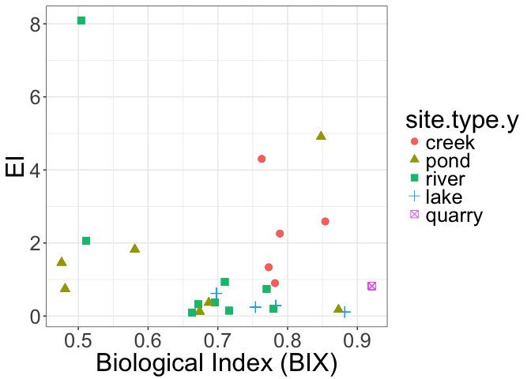

2017\_04\_26 manuscript script
================
Abby
April 26, 2017

Project Purpose
---------------

The purpose of this project was to create a data set that would allow easy and clear access to my thesis work. This script is used to combine data sets and make figures that can be published.

All data has been manipulated to be in the proper format. Next, enzyme activities need to be calculated.

``` r
#calculate the the total enzyme activity by each enzyme class (peptidase, glucosidase, and phosphatase)
tote <- ddply(v0_summ.kc, c("site", "sample.type", "treatment", "site.type", "enzyme.class"),
              summarise,
              sum.v0=sum(kc.v0, na.rm=TRUE))

#calculate the total enzyme activity of each substrate 
substrate_total <- ddply(v0_summ.kc, c("site", "sample.type", "treatment", "site.type", "substrate"),
              summarise,
              sum.v0=sum(kc.v0, na.rm=TRUE))
```

In order to look at the relationship of endopeptidase to exopeptidase we need to calcualte the ratio of Endo to Exo using GGR- AMC = Endopeptidase and Leu-AMC = Exopeptidase, this ratio is reffered to as EI.

``` r
EI.df<-ddply(substrate_total, c("site", "sample.type", "treatment"),
           summarise, 
           EI = (sum(sum.v0[substrate == "GGR-AMC"]) / 
                         sum(sum.v0[substrate == "Leu-AMC"])))
```

Add the EI data back into the total data set by merging the EI data frame with the substrate total data frame, which includes

``` r
finalenzyme<-merge(substrate_total, EI.df, by = c("site", "sample.type","treatment"), all= TRUE)

#add state locations to all sites
finalenzyme$site.location <-revalue(finalenzyme$site, c("victor ashe" = "tn",
                                      "third creek" = "tn", 
                                      "clinton city park" = "tn",
                                      "clinch river" = "tn",
                                      "cove lake" = "tn", 
                                      "norris dam" = "tn",
                                      "volunteer landing" = "tn",
                                      "second creek" = "tn",
                                      "anchor down" = "tn",
                                      "douglas dam" = "tn",
                                      "chilowee park" = "tn",
                                      "holston hills park" = "tn",
                                      "fort dickerson" = "tn",
                                      "ut med pond" = "tn",
                                      "cherokee reservoir" = "tn", 
                                      "mossy spring" = "tn",
                                      "little river" = "tn", 
                                      "west prong" = "tn", 
                                      "tyson park" = "tn",
                                      "sequoyah hills" = "tn",
                                      "fish pond" = "tn", 
                                      "bb1" = "pa", 
                                      "bb2" = "pa", 
                                      "pickerel pond" = "pa",
                                      "briscoe swamp" = "pa",
                                      "sinking creek " = "tn",
                                      "ten mile " = "tn",
                                      "front pond" = "pa",
                                      "wampler keith" = "tn",
                                      "telico lake" = "tn", 
                                      "meads quarry" = "tn",
                                      "toll creek" = "tn"))

#order the sites for finalenzyme data frame
finalenzyme$site.type<-factor(finalenzyme$site.type, levels = c("creek", "pond", "river", "lake", "quarry"))
```

Merging in all data from geochemical and environmental parameters is necessary to do final analysis.

``` r
#load all geochemical and organic carbon data 
geochemical_data <-read.csv("../data/2016_03_21 barrett thesis data .csv")

#convert npoc and tn 
geochemical_data$npoc.umol.l<-(geochemical_data$npoc/12.0107)*1000
geochemical_data$tn.umol.l<-(geochemical_data$tn/14.0067)*1000

fdom<-read.csv("../data/2017_01_18 fdom output.csv")
fdom$abs254<-fdom$abs254*100

#merge data with enzyme data
fdom_tocl<-merge(geochemical_data, fdom, by = c("site"))

#add enzyme classes back in, by enzyme sub class 
finalenzyme$enzyme.sub.class <- revalue(finalenzyme$substrate, c("Arg-AMC"="exopeptidase", "Gly-AMC"="exopeptidase", "Leu-AMC"="exopeptidase", "Pyr-AMC"="exopeptidase", "GGR-AMC"="endopeptidase", "MUB-gluco"="glucosidase","MUB-Phos"="phosphatase"))

# add classes of pep glu and phos 
finalenzyme$enzyme.class <- revalue(finalenzyme$substrate, c("Arg-AMC"="peptidase", "Gly-AMC"="peptidase", "Leu-AMC"="peptidase", "Pyr-AMC"="peptidase", "GGR-AMC"="peptidase", "MUB-gluco"="glucosidase","MUB-Phos"="phosphatase"))

thesis_data <-merge(fdom_tocl, finalenzyme, by = "site")
#merge nutrient data and geochemical data 
final_subset <- subset(thesis_data, thesis_data$treatment == 'live' & thesis_data$sample.type == 'whole' & thesis_data$enzyme.class == 'peptidase')


pep.sum <- ddply(final_subset, c("site", "treatment", "site.location", "sample.type", "enzyme.class"), 
                                         summarise, 
                                         pep.sumv0 = sum(sum.v0))
final_thesis_data <- merge(final_subset, pep.sum, by = c("site", "treatment", "site.location", "sample.type" ))
```

All data is now merged and one final data frame can be used to analyze all of the parameters.

``` r
# hydrolysis rates by substrate at each location and site type 
abs_v0 <- ggplot(final_thesis_data, aes(x = substrate, y = sum.v0))+
  geom_boxplot()+
  scale_y_log10()+
  geom_point(aes( color = site.type.x, shape = site.type.x))+
  xlab("Substrate")+
  ylab(ylab(expression(paste("log", " ",v[0], ", ", mu, "mol ", L^{-1}, " ", hr^{-1}))))
  #labs(color = "Site Type")
print(abs_v0)
```

    ## Warning in self$trans$transform(x): NaNs produced

    ## Warning: Transformation introduced infinite values in continuous y-axis

    ## Warning in self$trans$transform(x): NaNs produced

    ## Warning: Transformation introduced infinite values in continuous y-axis

    ## Warning: Removed 12 rows containing non-finite values (stat_boxplot).

    ## Warning: Removed 7 rows containing missing values (geom_point).



In order understand controls on extracellular enzymes its important to understand the relationships between cell counts and DOC concentration.

``` r
EI_DOC <- ggplot(final_thesis_data, aes(x = umolC.L, y = EI, color = site.type.y, shape = site.type.y))+
  geom_point(size = 3)+
  xlab("DOC")+
  ylab("EI")
print(EI_DOC)
```

    ## Warning: Removed 5 rows containing missing values (geom_point).


``` r
sumv0_DOC <- ggplot(final_thesis_data, aes(x = umolC.L, y = pep.sumv0, color = site.type.y, shape = site.type.y))+
  scale_y_log10()+
  geom_point(size = 3)+
  xlab("DOC")+
  ylab(ylab(expression(paste("log", " ", v[0], ", ", mu, "mol ", L^{-1}, " ", hr^{-1}))))
print(sumv0_DOC)
```

    ## Warning: Transformation introduced infinite values in continuous y-axis


``` r
EI_Cell <- ggplot(final_thesis_data, aes(x = cells.ml, y = EI, color = site.type.y, shape = site.type.y))+
  geom_point(size = 3)+
  xlab("DOC")+
  ylab("EI")
print(EI_Cell)
```

    ## Warning: Removed 15 rows containing missing values (geom_point).


``` r
sumv0_Cell <- ggplot(final_thesis_data, aes(x = cells.ml, y = pep.sumv0, color = site.type.y, shape = site.type.y))+
  scale_y_log10()+
  geom_point(size = 3)+
  xlab("DOC")+
  ylab(ylab(expression(paste("log", " ", v[0], ", ", mu, "mol ", L^{-1}, " ", hr^{-1}))))
print(sumv0_Cell)
```

    ## Warning: Transformation introduced infinite values in continuous y-axis

    ## Warning: Removed 10 rows containing missing values (geom_point).


``` r
EI_sumv0 <- ggplot(final_thesis_data, aes(x = pep.sumv0, y = EI, color = site.type.y, shape = site.type.y))+
  scale_x_log10()+
  geom_point(size = 3)+
  ylab("EI")+
  xlab(xlab(expression(paste("log", " ", v[0], ", ", mu, "mol ", L^{-1}, " ", hr^{-1}))))
print(EI_sumv0)
```

    ## Warning: Transformation introduced infinite values in continuous x-axis

    ## Warning: Removed 5 rows containing missing values (geom_point).


Fluoresently dissolved organic matter data will proived information on what OC sources are in these systems.

``` r
EI_SUVA254 <- ggplot(final_thesis_data, aes(x = abs254, y = EI, color = site.type.y, shape = site.type.y))+
  geom_point(size = 3)+
  ylab("EI")+
  xlab("SUVA254")
print(EI_SUVA254)
```

    ## Warning: Removed 5 rows containing missing values (geom_point).


``` r
EI_FI <- ggplot(final_thesis_data, aes(x = fi, y = EI, color = site.type.y, shape = site.type.y))+
  geom_point(size = 3)+
  ylab("EI")+
  xlab("Fluoresence Index")
print(EI_FI)
```

    ## Warning: Removed 5 rows containing missing values (geom_point).


``` r
EI_BIX <- ggplot(final_thesis_data, aes(x = BIX, y = EI, color = site.type.y, shape = site.type.y))+
  geom_point(size = 3)+
  ylab("EI")+
  xlab("Biological Index (BIX)")
print(EI_BIX)
```

    ## Warning: Removed 5 rows containing missing values (geom_point).

 In order to understand what happens to enzyme activity with different carbon sources, we looked at the addition of known carbon sources.

``` r
#load packages
library(plyr) #split-apply-combine
library(lubridate) # deals with dates
library(ggplot2) # makes graphics
library(lme4)
```

    ## Loading required package: Matrix

``` r
library(vegan)
```

    ## Loading required package: permute

    ## Loading required package: lattice

    ## This is vegan 2.4-2

``` r
#install_github("adsteen/lmstats")
library(lmstats)
#source("../R/lm_stats.R")
theme_set(theme_bw() +
            theme(text=element_text(size=16)))

#load data 
d <-read.csv("../data/2017_02_27 manipulation data.csv", na.strings = "NA", stringsAsFactors = TRUE)

# Delete any rows with NA in the rfu column
d <- d[!is.na(d$rfu), ]

# Change the substrate numbers to substrate names
d$substrate <- revalue(as.factor(d$sub), c("1"="Arg-AMC", "2"="Leu-AMC", "3"="GGR-AMC"))

d$Rtime <- mdy_hm(paste(d$date, d$time)) # mdy_hms converts time (as text, in the format year-month-day hour-minute-second) into computer time format 
d$R.exp.time <- mdy_hm(paste(d$exp.date, d$exp.time)) # This is the time hte experiment was started

d$exp.elapsed <- as.numeric(d$R.exp.time-min(d$R.exp.time)) / 3600
attr(d$exp.elapsed, "units") <- "hours"

# Calculate elapsed time
d <- ddply(d, c("treatment", "substrate","R.exp.time"), mutate, 
           elapsed = as.numeric(Rtime-min(Rtime))/3600) # Talk to me about what ddply does
d$exp.elapsed <- as.numeric(d$R.exp.time-min(d$R.exp.time)) / 3600
attr(d$exp.elapsed, "units") <- "hours"

#use this tid bit to check the raw data 
#treatmemt.c <- subset(d,treatment == "A" & exp.date== "2/13/17", na.strings = "NA", stringsAsFactors = TRUE)
#treatment.c<- treatmemt.c[!is.na(treatmemt.c$rfu), ]
#p_raw <- ggplot(treatmemt.c, aes(x=elapsed, y=rfu, color = rep)) + # "make a plot from data frame d, with elapsed on the x axis, rfu on the y axis, replicate represented by shape and sample.type represented by colour
  ##geom_smooth(method="lm" )+ # also represent data with a smoothed function (use "lm" - linear model - as the smoothing function)
  #facet_wrap(~substrate, scales = "free")
#print(p_raw)
#ggsave("plots/2017_02_24 p_raw.png", height = 25 , width = 30, units = "in")

# Calculate slopes at each "experimental elapsed time"
#slopes <- ddply(d, c("treatment", "substrate", "R.exp.time"), function(x) lm_stats(x, xvar="exp.elapsed", yvar="rfu"))
#d$treatment<- levels(factor(d$treatment))
slopes <- ddply(d, c("treatment", "substrate", "rep", "exp.elapsed", "R.exp.time", "fluorophore"), function(x) lm_stats(x, xvar="elapsed", yvar="rfu"))

###########
# Calibrate the data
###########

calib <- read.csv("../data/2017_02_20 manipulation calibration.csv", stringsAsFactors = FALSE)
calib$conc.uM <- calib$volume.ul * 10
attr(calib$conc.uM, "units") <- "micromolar"

# Check the calibration curve graphically
ggplot(calib, aes(x=conc.uM, y=rfu)) + 
  geom_point() + 
  geom_smooth(method="lm", se=TRUE) + 
  facet_grid(~treatment, scales="free")
```


``` r
# Calculate the slope of the calibration curve for each site, sample type and fluorophore
calib_slopes <- ddply(calib, c("substrate", "treatment"), function(x) lm_stats(x, "conc.uM", "rfu"))
attr(calib_slopes$slope, "units") <- "rfu per micromolar"
calib_slopes<- rename(calib_slopes, c("slope" = "calib.slope", "substrate" = "fluorophore"))
########
# Include the slope of the calibration curve in the data frame of slopes of rfu/time
########

# Code the data frame of slopes with which fluorophore the substrate uses
slopes$fluorophore <- NA 
slopes$fluorophore[grepl("AMC", slopes$substrate)] <- "AMC"


slopes_m <- merge(slopes, calib_slopes [ , c("treatment", "calib.slope"),], by=c("treatment"))

# Calibrate the slopes (of rfu vs time) by dividing by the calibration curve slope (slope of rfu vs concentration in uM)
slopes_m$v0 <- slopes_m$slope / slopes_m$calib.slope
attr(slopes_m$v0, "units") <- "uM per hour"
slopes_m$v0.se <- slopes_m$slope.se / slopes_m$calib.slope

#rename data 
manipulation <- slopes_m

#calculate endoexo 
manipulation$enzyme.class <- revalue(manipulation$substrate, c("Arg-AMC"="exopeptidase", "Leu-AMC"="exopeptidase", "GGR-AMC"="endopeptidase"))
manipulation$life.status <- revalue(manipulation$treatment, c("A"= "live", "B"= "live","C"= "live","D"= "live","E"= "live","F"= "kill"))

manipulation_data<- ddply(manipulation, c("treatment", "exp.elapsed", "substrate", "enzyme.class"),
                 summarise,
                 mean.v0 = mean(v0, na.rm=TRUE),
                 sd.v0 = sd(v0, na.rm=TRUE), 
                 ymin = min(v0),
                 ymax = max(v0)) 
manipulation_data$treatment<-revalue(manipulation_data$treatment, c("A"="BSA", "B"="Acetate_Ammonium", "C"="SR-NOM", "D"="Ammonium", "E"="Unfiltered", "F"= "Kill"))
manipulation_data <- subset(manipulation_data, treatment %in% c('BSA', 'Acetate_Ammonium', 'SR-NOM','Ammonium','Unfiltered'))


sub_plot <- ggplot(manipulation_data, aes(x = exp.elapsed, y = mean.v0, color = substrate))+
                     geom_point()+
                      geom_line()+
  geom_pointrange(aes(ymin=mean.v0-sd.v0, ymax=mean.v0+sd.v0))+
                     xlab("Elapsed Time")+
  ylab(ylab(expression(paste( v[0], ", ", "(", mu, "mol ", L^{-1}, " ", hr^{-1}, ")"))))+
                    facet_wrap(~treatment, scales = "free", nrow = 6)
print(sub_plot)
```


``` r
ggsave("../plots/2017_04_10 substrate plots manipulation.png", height = 10.5, width = 8, units = "in")
```
